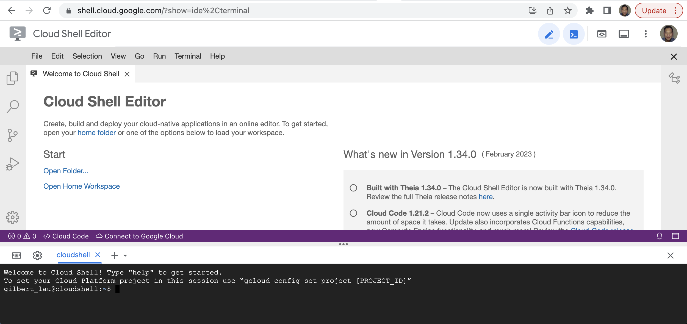
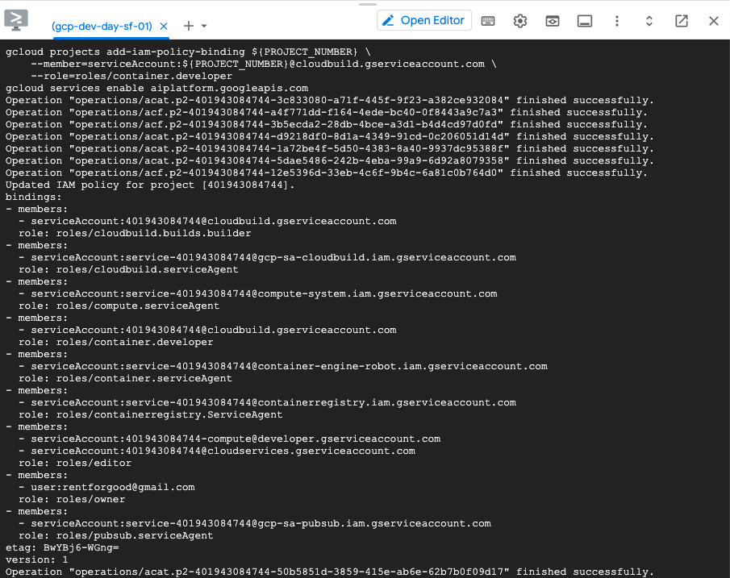

# Lab 0: Open a Google Cloud Shell and Enable APIs

If you do not have an existing Google Cloud account, you can create a free trial account with $300 credit. Detail is [here]( https://cloud.google.com/free/docs/free-cloud-features#free-trial). Start Free [here](https://cloud.google.com/)!
   
**It is recommend to create a new Google Cloud project for this workshop as it is easier to clean up upon completion.** 
    
#### Open a Cloud Shell
Once you successfully log into your Google Cloud account, you can open a Cloud Shell to begin your lab.
          
[](https://shell.cloud.google.com/)

      
Set the following project value:
```bash
gcloud config set project <YOUR PROJECT ID>
```
Run the followings to enable Google Cloud service APIs:
```bash
export PROJECT_ID=$(gcloud info --format='value(config.project)')
gcloud services enable sourcerepo.googleapis.com
gcloud services enable compute.googleapis.com
gcloud services enable container.googleapis.com
gcloud services enable anthos.googleapis.com
gcloud services enable meshca.googleapis.com
gcloud services enable sqladmin.googleapis.com
gcloud services enable cloudbuild.googleapis.com
PROJECT_NUMBER="$(gcloud projects describe ${PROJECT_ID} --format='get(projectNumber)')"
gcloud projects add-iam-policy-binding ${PROJECT_NUMBER} \
    --member=serviceAccount:${PROJECT_NUMBER}@cloudbuild.gserviceaccount.com \
    --role=roles/container.developer
gcloud services enable aiplatform.googleapis.com
```
Once all APIs are enabled, you should see similar output below in your Cloud Shell:
   
             
[>> Next Lab (1) >>](../lab1/README.md)    
