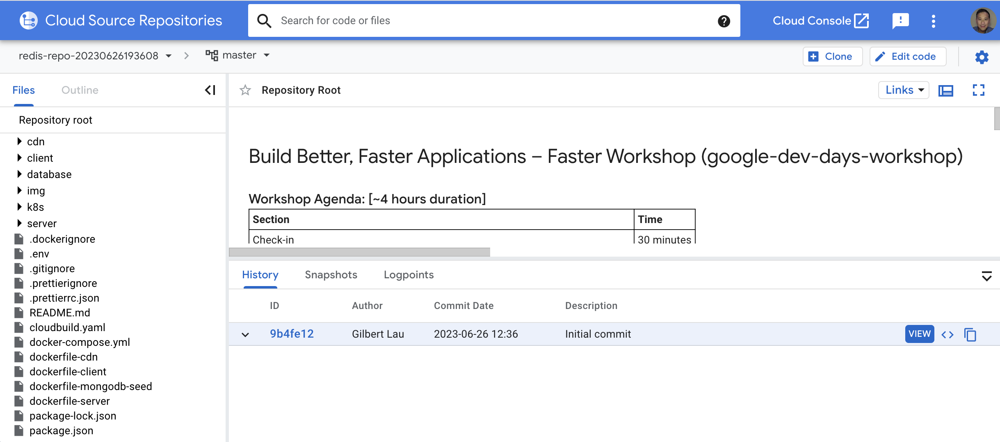

# Lab 1: Create a Cloud Source repo for the workshop sample app

Set your GCP Project:
```bash
gcloud config set project <PROJECT_ID>
```
Create a new Cloud Source repo:
```bash
export PROJECT_ID=$(gcloud info --format='value(config.project)')
export REDIS_REPO="redis-repo-$(date +'%Y%m%d%H%M%S')"
gcloud source repos create $REDIS_REPO
git clone https://source.developers.google.com/p/$PROJECT_ID/r/$REDIS_REPO
```
Deposit workshop sample app into the repo:
```bash
cd $REDIS_REPO
gsutil cp gs://redis-dev-days-workshop/google-dev-days-workshop-main.zip .
unzip google-dev-days-workshop-main.zip
mv google-dev-days-workshop-main/{*,.[^.]*,..?*} .
rm -fr google-dev-days-workshop-main
rm google-dev-days-workshop-main.zip
git add .
git commit -m "Initial commit"
git push -u origin master
```
You can confirm the repo has been successfully created in Google Cloud Console:

