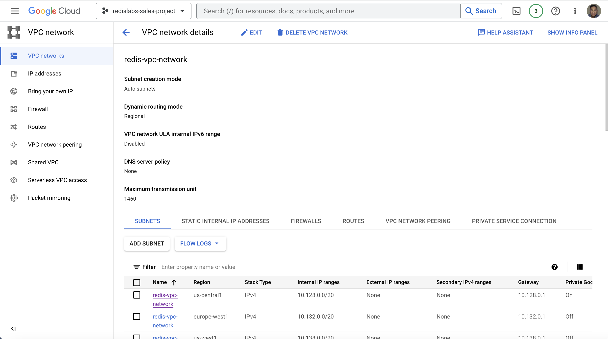
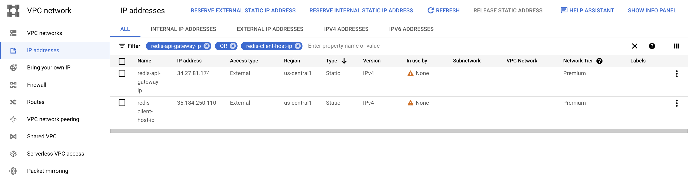
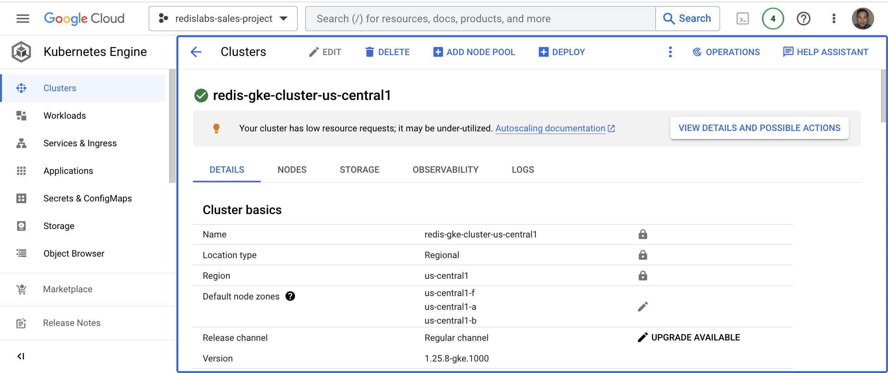
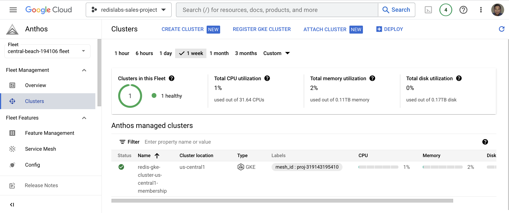
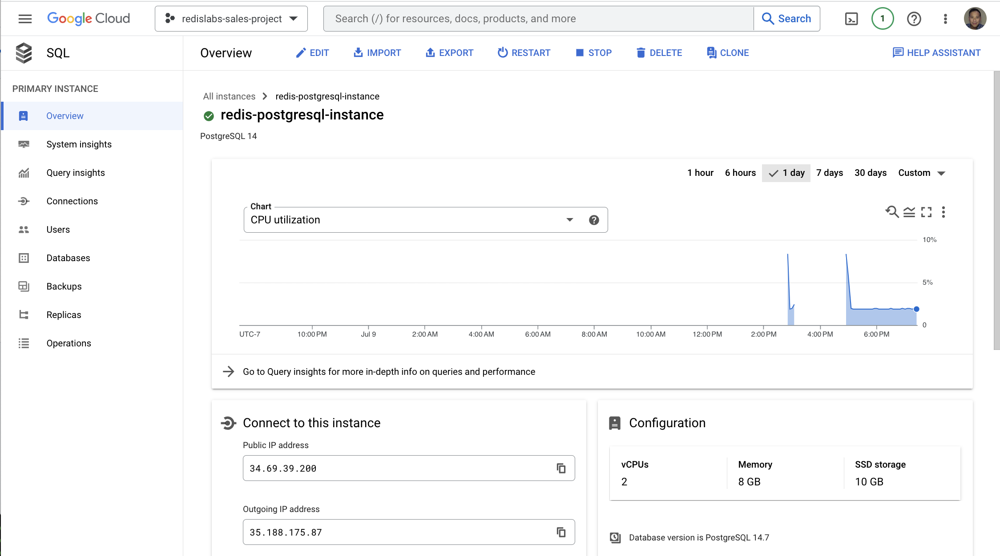

# Lab 2: Create Google Cloud Infrastrcuture Components
     
In this lab, you are going to:
* Create a VPC
* Create two external static IP addresses
* Create a GKE cluster
* Provision managed Anthos Service Mesh on the GKE cluster
* Create a CloudSQL PostgreSQL database instance
          
Create a VPC:
```bash
export VPC_NETWORK="redis-vpc-network"
export SUBNETWORK=$VPC_NETWORK
gcloud compute networks create $VPC_NETWORK \
    --subnet-mode=auto
```
     
On success, you should view your VPC network as follows:

    

Reserve external static IP addresses:
```bash
gcloud compute addresses create redis-api-gateway-ip --region us-central1
export REDIS_API_GATEWAY_IP="$(gcloud compute addresses describe redis-api-gateway-ip --region=us-central1 --format='value(address)')"
```
```bash
gcloud compute addresses create redis-client-host-ip --region us-central1
export REDIS_CLIENT_HOST_IP="$(gcloud compute addresses describe redis-client-host-ip --region=us-central1 --format='value(address)')"
```    

On success, you should see the newly created reserved public IP addresses as shown below:
   
     
Create a GKE cluster:
```bash
export PROJECT_ID=$(gcloud info --format='value(config.project)')
export PROJECT_NUMBER=$(gcloud projects list --filter="$PROJECT_ID" --format="value(PROJECT_NUMBER)")
export CLUSTER_LOCATION=us-central1
export CLUSTER_NAME="redis-gke-cluster-$CLUSTER_LOCATION"

gcloud container clusters create $CLUSTER_NAME \
    --project=$PROJECT_ID \
    --region=$CLUSTER_LOCATION \
    --machine-type=e2-standard-8 \
    --network=$VPC_NETWORK \
    --subnetwork=$SUBNETWORK \
    --num-nodes=1 \
    --workload-pool=${PROJECT_ID}.svc.id.goog \
    --labels="mesh_id=proj-${PROJECT_NUMBER}"
```

On success, you should see your newly created GKE cluster like below:

         
Provision Anthos Service Mesh:    
Enable Anthos Service Mesh on your project's Fleet:
```bash
gcloud container fleet mesh enable --project $PROJECT_ID
```
Register the cluster to the project's Fleet:
```bash
gcloud container fleet memberships register $CLUSTER_NAME-membership \
  --gke-cluster=${CLUSTER_LOCATION}/${CLUSTER_NAME} \
  --enable-workload-identity \
  --project ${PROJECT_ID}
```
On success, you can verify the GKE cluster's fleet membership in Google Cloud Console:

         
Provision managed Anthos Service Mesh on the cluster using the Fleet API:
```bash
gcloud container fleet mesh update \
  --management automatic \
  --memberships ${CLUSTER_NAME}-membership \
  --project ${PROJECT_ID}
```
Wait for about ~10 minutes and run the command below to verify ASM is enabled:
```bash
gcloud container fleet mesh describe --project $PROJECT_ID
```
You should see the following states equal to `ACTIVE`  when the installation of Anthos Service Mesh has been completed:
```bash
membershipStates:
  projects/319143195410/locations/us-central1/memberships/redis-gke-cluster-us-central1-membership:
    servicemesh:
      controlPlaneManagement:
        details:
        - code: REVISION_READY
          details: 'Ready: asm-managed'
        state: ACTIVE
      dataPlaneManagement:
        details:
        - code: OK
          details: Service is running.
        state: ACTIVE
```
Enable "default" namespace for sidecar injection
```bash
kubectl label namespace default istio-injection=enabled istio.io/rev-
```
You should see the following output on success:
```
label "istio.io/rev" not found.
namespace/default labeled
```
Verify the auto sidecar injection is enabled by running:
```bash
kubectl get ns default -oyaml
```
You should see the following output with "istio-injection: enabled" label in the `default` namespace's definition:
```
apiVersion: v1
kind: Namespace
metadata:
  creationTimestamp: "2023-06-30T16:21:36Z"
  labels:
    istio-injection: enabled
    kubernetes.io/metadata.name: default
  name: default
  resourceVersion: "8107"
  uid: 383da266-09a6-4fa3-b12c-6e62e62b3d84
spec:
  finalizers:
  - kubernetes
status:
  phase: Active
```
    
Create the Source DB - Cloud SQL for PostgreSQL:    
Note: **database-flags=cloudsql.logical_decoding=on** enables logical replication workflows and change data capture (CDC) workflows which is required by RDI.     
Create PostgreSQL instance:   
```bash
export ZONE=us-central1-a
export POSTGRESQL_INSTANCE=redis-postgresql-instance

gcloud sql instances create $POSTGRESQL_INSTANCE \
--database-version=POSTGRES_14 \
--cpu=2 \
--memory=8GiB \
--zone=$ZONE \
--authorized-networks=0.0.0.0/0 \
--root-password=postgres \
--database-flags=cloudsql.logical_decoding=on
```
On success, you can see your CloudSQL PostgreSQL database in Google Cloud console like the following:

Capture the `Public IP address` for later use in the lab in an environment variable:
```bash
export POSTGRESQL_INSTANCE_IP=$(gcloud sql instances describe $POSTGRESQL_INSTANCE --format=json | jq -r '.ipAddresses[] | select(.type == "PRIMARY") | .ipAddress')
```
                
By default, PostgreSQL database superuser (postgres) does not have permission to create a replication slot which is required by RDI.  Run the following commands to grant the permission:  
```bash
cat <<EOF > alter_postgres_replication.sql
alter user postgres with replication;
EOF
```
```
gcloud sql connect $POSTGRESQL_INSTANCE --user postgres < alter_postgres_replication.sql
```
When prompted for password (Connecting to database with SQL user [postgres].Password:), enter `postgres` and hit return    
On success, you should see the following output:
```
Connecting to database with SQL user [postgres].Password:
ALTER ROLE
```
    
[<< Previous Lab (1) <<](../lab1/README.md)     |      [>> Next Lab (3) >>](../lab3/README.md)

