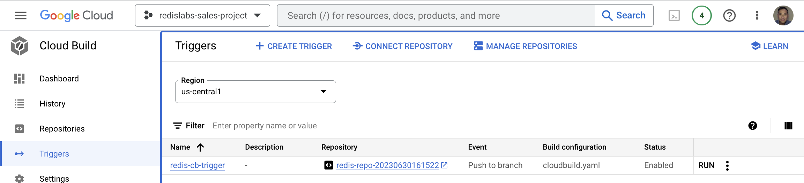
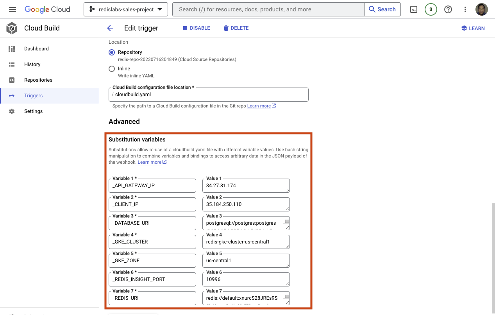
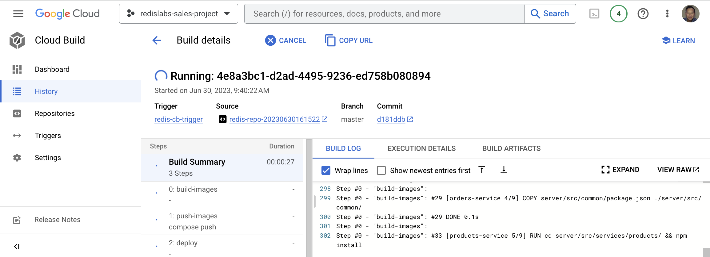
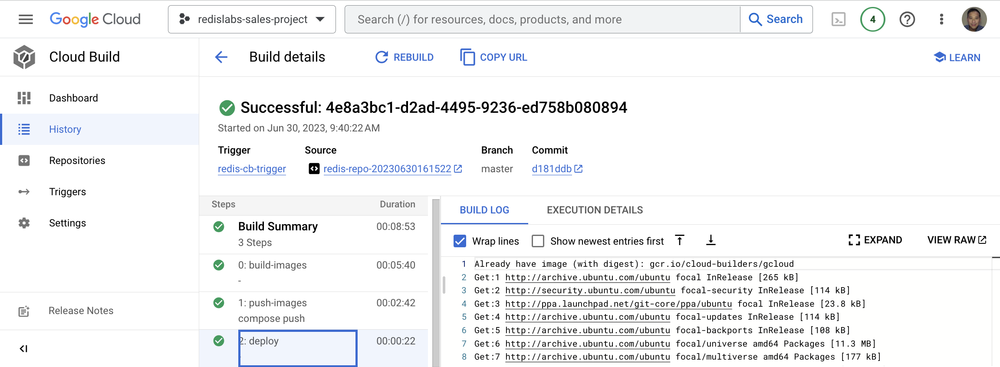
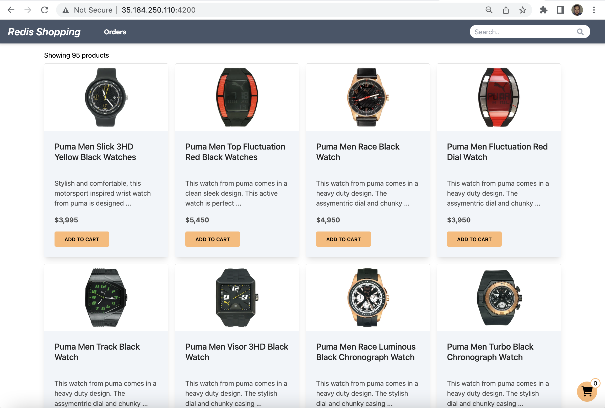
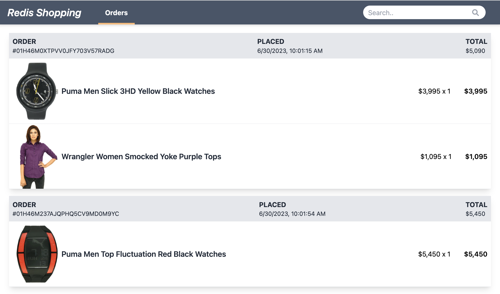

# Lab 4: Create a Google Cloud Build Trigger and Deploy the Sample App
Create Cloud Build Trigger:
```bash
export PROJECT_ID=$(gcloud info --format='value(config.project)')
export CLUSTER_LOCATION=us-central1
export CLUSTER_NAME="redis-gke-cluster-$CLUSTER_LOCATION"
export REDIS_API_GATEWAY_IP="$(gcloud compute addresses describe redis-api-gateway-ip --region=us-central1 --format='value(address)')"
export REDIS_CLIENT_HOST_IP="$(gcloud compute addresses describe redis-client-host-ip --region=us-central1 --format='value(address)')"
export DATABASE_URL="postgresql://postgres:postgres@${POSTGRESQL_INSTANCE_IP}:5432/dbFashion?schema=public"
export REDIS_CLOUD_BUILD_TRIGGER="redis-cb-trigger"
export IS_RDI_ENABLED="false"

gcloud alpha builds triggers create cloud-source-repositories \
  --name=$REDIS_CLOUD_BUILD_TRIGGER \
  --repo=$REDIS_REPO \
  --branch-pattern=^master$ \
  --build-config=cloudbuild.yaml \
  --substitutions=_GKE_CLUSTER=$CLUSTER_NAME,_GKE_ZONE=$CLUSTER_LOCATION,_API_GATEWAY_IP=$REDIS_API_GATEWAY_IP,_CLIENT_IP=$REDIS_CLIENT_HOST_IP,_REDIS_URI=$REDIS_URI,_REDIS_INSIGHT_PORT=$REDIS_INSIGHT_PORT,_DATABASE_URI=$DATABASE_URL,_IS_RDI_ENABLED=$IS_RDI_ENABLED \
  --region=$CLUSTER_LOCATION
```
On success, you should see the newly created trigger inside Google Cloud Console:

    
You can click on the `redis-cb-trigger` link and see its details as shown below. Make sure you see all **seven** variables are correctly configured. 

Click `CANCEL` when done reviewing.
         
Run the trigger to deploy the sample app:
```bash
gcloud alpha builds triggers run $REDIS_CLOUD_BUILD_TRIGGER --branch=master --region=$CLUSTER_LOCATION
```
    
On success, you should see a similar build-in-process like below:
)
    
A successful build will look like the following:

   
You can verify the container images are published to your private container registry like below:

        
Run the following command to ensure all the microservices are up and running:
```bash
watch kubectl get all
```
You will also find the REDIS_CLIENT_HOST_IP information from the command above:
```
For example,

service/client          LoadBalancer   10.100.5.142    35.184.250.110   4200:30519/TCP   2m25s
```
        
You can now access the sample app and make a few purchases by pointing your browser at:
```bash
http://<$REDIS_CLIENT_HOST_IP>:4200
```

    
After making a couple purchases, here is a sample screen shot of the order history page:

The order history data is retrieved from Redis Enterprise (in-memory).
     
[<< Previous Lab (3) <<](../lab3/README.md)     |      [>> Next Lab (5) >>](../lab5/README.md)

