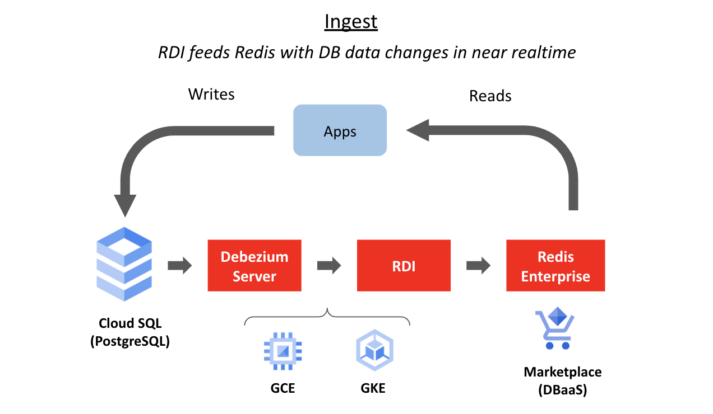

# Lab 5: Set up Redis Data Integration (RDI)


    
#### 1. Provision a CloudSQL PostgreSQL instance:

#### 2. Deploy Radis Data Integration:
Deploy a Redis Enterprise cluster:
```bash
kubectl create namespace redis
kubectl config set-context --current --namespace=redis

VERSION=`curl --silent https://api.github.com/repos/RedisLabs/redis-enterprise-k8s-docs/releases/latest | grep tag_name | awk -F'"' '{print $4}'`

kubectl apply -n redis -f https://raw.githubusercontent.com/RedisLabs/redis-enterprise-k8s-docs/$VERSION/bundle.yaml
```
```bash
cat <<EOF > rec.yaml
apiVersion: "app.redislabs.com/v1"
kind: "RedisEnterpriseCluster"
metadata:
  name: rec
spec:
  nodes: 3
EOF

kubectl apply -f rec.yaml -n redis 
```
It will take between 6 and 8 minutes to complete. You can run the following command to see the progress:
```bash
watch kubectl get all
```    
    
Then, retrieve the password for the Redis Enterprise Cluster's default uesr: demo@redis.com:
```bash
export REC_PWD=$(kubectl get secrets -n redis rec -o jsonpath="{.data.password}" | base64 --decode)
```
    
Note: You can open another Google Cloud Shell to grab the $REC_PWD and display its value in the shell for later use:
```
export REC_PWD=$(kubectl get secrets -n redis rec -o jsonpath="{.data.password}" | base64 --decode)
echo $REC_PWD
```
         
Install Redis Gears:
```bash
kubectl exec -it rec-0 -n redis -- curl -s https://redismodules.s3.amazonaws.com/redisgears/redisgears_python.Linux-ubuntu18.04-x86_64.1.2.6.zip -o /tmp/redis-gears.zip

kubectl exec -it rec-0 -n redis -- curl -k -s -u "demo@redis.com:${REC_PWD}" -F "module=@/tmp/redis-gears.zip" https://localhost:9443/v2/modules
```
On success, you should see similar output below:
```
Defaulted container "redis-enterprise-node" out of: redis-enterprise-node, bootstrapper
Defaulted container "redis-enterprise-node" out of: redis-enterprise-node, bootstrapper
{"action_uid":"e0a88d27-4c52-4e9e-b1f1-6095baa4d184","author":"RedisLabs","capabilities":["types","crdb","failover_migrate","persistence_aof","persistence_rdb","clustering","backup_restore","reshard_rebalance","eviction_expiry","intershard_tls","intershard_tls_pass","ipv6"],"command_line_args":"Plugin gears_python CreateVenv 1","config_command":"RG.CONFIGSET","crdb":{},"dependencies":{"gears_python":{"sha256":"5206dfc7199e66c6cfe7a9443c5705e72ceccaccc02d229607e844337e00ce7f","url":"http://redismodules.s3.amazonaws.com/redisgears/redisgears-python.Linux-ubuntu18.04-x86_64.1.2.6.tgz"}},"description":"Dynamic execution framework for your Redis data","display_name":"RedisGears","email":"meir@redislabs.com","homepage":"http://redisgears.io","is_bundled":false,"license":"Redis Source Available License Agreement","min_redis_pack_version":"6.0.12","min_redis_version":"6.0.0","module_name":"rg","semantic_version":"1.2.6","sha256":"ca9c81c7c0e523a5ea5cf41c95ea53abcd6b90094be2f0901814dd5fdbc135d6","uid":"d97a561c5e94e78d60c5b2dfa48a427a","version":10206}
```
         
Install RDI CLI container:
```bash
kubectl config set-context --current --namespace=default

cat << EOF > /tmp/redis-di-cli-pod.yml
apiVersion: v1
kind: Pod
metadata:
  name: redis-di-cli
  labels:
    app: redis-di-cli
spec:
  containers:
    - name: redis-di-cli
      image: docker.io/redislabs/redis-di-cli
      volumeMounts:
      - name: config-volume
        mountPath: /app
      - name: jobs-volume
        mountPath: /app/jobs
  volumes:
    - name: config-volume
      configMap:
        name: redis-di-config
        optional: true
    - name: jobs-volume
      configMap:
        name: redis-di-jobs
        optional: true
EOF
kubectl apply -f /tmp/redis-di-cli-pod.yml
```
    
Create a new RDI database:
```bash
kubectl exec -it -n default pod/redis-di-cli -- redis-di create --cluster-host localhost 
```
    
Use the following input and answer the rest of the prompt:
```bash
Host/IP of Redis Enterprise Cluster: rec.redis.svc.cluster.local
Redis Enterprise Cluster username: demo@redis.com
Redis Enterprise Cluster Password: grab password from $REC_PWD
Everything else take the default valuest
Password for the new RDI Database: redis 
```
On success, you should see similar output like below:
```
Creating new RDI database:
 name: redis-di-1
 port: 12001
 memory: 100MB
 shards: 1
 replication: False
New instance created on port 12001:
 DNS: redis-12001.rec.redis.svc.cluster.local
 ADDR: 10.96.2.9
INFO - Trying to establish connection to redis-12001.rec.redis.svc.cluster.local on port 12001
INFO - Trying to establish connection to 10.96.2.9 on port 12001
Setting up RDI Engine on port 12001
Successfully configured RDI database on port 12001
Default Context created successfully
```
              
Edit config.yaml:    
Update the value of the following fields in the `connections:target:` section:    
```
host: <Redis Enterprise database host in Lab 3>
port: <Redis Enterprise database port in Lab 3>
user: default
password: <Redis Enterprise database user in Lab3>
```
    
Create a ConfigMap for Redis Data Integration:
```bash
kubectl create configmap redis-di-config --from-file=config.yaml -n default
```
You might need to wait for 30 seconds or more for the configmap to be ready for next step. 
        
Deploy the RDI configuration:   
```bash
kubectl exec -n default -it pod/redis-di-cli -- redis-di deploy
```
When prompted for password (RDI Database Password []:), enter `redis` and hit return.
        
      
Edit application.properties:    
Update the value of the following fields with the CloudSQL PostgreSQL's public IP address. You can run `echo $POSTGRESQL_INSTANCE_IP` to display the value of the IP address.
```
debezium.source.database.hostname=
```
      
Create a ConfigMap for Debezium Server:
```bash
kubectl create configmap debezium-config --from-file=application.properties -n default
```    
You might need to wait for 30 seconds or more for the configmap to be ready for next step. 
      
Create the Debezium Server Pod:
```bash
cat << EOF > /tmp/debezium-server-pod.yml
apiVersion: v1
kind: Pod
metadata:
  name: debezium-server
  labels:
    app: debezium-server
spec:
  containers:
    - name: debezium-server
      image: docker.io/debezium/server
      livenessProbe:
        httpGet:
            path: /q/health/live
            port: 8088
      readinessProbe:
        httpGet:
            path: /q/health/ready
            port: 8088
      volumeMounts:
      - name: config-volume
        mountPath: /debezium/conf
  volumes:
    - name: config-volume
      configMap:
        name: debezium-config
EOF
kubectl apply -f /tmp/debezium-server-pod.yml
```
       
Create a ConfigMap for the two RDI jobs for replicating order information from CloudSQL to Redis:
```bash
kubectl create configmap redis-di-jobs --from-file=./rdi_jobs
```
You will need to wait for 30 seconds or so before the configmap can be consumed by the RDI pod.     
Deploy the RDI job:
```bash
kubectl exec -n default -it pod/redis-di-cli -- redis-di deploy
```
When prompted for password (RDI Database Password []:), enter `redis` and hit return   
You should similar output if the jobs are successfully created:
```
INFO - Reading orders.yaml job
INFO - Reading orderProducts.yaml job
RDI Database Password []: 
WARNING - Property 'json_update_strategy' will be deprecated in future releases. Use 'on_update' job-level property to define the json update strategy.
Deploying settings to 10.96.0.22:12001
INFO - Connected to target database
INFO - RedisJSON is installed on the target Redis DB
Done
```    
       
Check if the job has been created:
```bash
kubectl exec -it -n default pod/redis-di-cli -- redis-di list-jobs
```
When prompted (RDI Database Password []:), enter `redis` then hit return
You should see a similar output like below:
```
Ingest Jobs
+---------------+--------+----+--------+---------------+-----------------+--------+-----+
| Name          | Server | DB | Schema | Table         | Transformations | Filter | Key |
+---------------+--------+----+--------+---------------+-----------------+--------+-----+
| orders        |        |    |        | orders        | Yes             | No     | Yes |
| orderProducts |        |    |        | orderProducts | Yes             | No     | No  |
+---------------+--------+----+--------+---------------+-----------------+--------+-----+
```
               
Verify the job status in RDI:
```bash
kubectl exec -n default -it pod/redis-di-cli -- redis-di status
```
When prompted (RDI Database Password []:), enter `redis` then hit return    
You should see a similar output like below:         
```
Status of Redis Data Integration version 0.101.3 on 10.96.0.22:12001

started

Engine State
Sync mode: cdc
Last data retrieved (source): 07/22/2023 23:26:56.000000 
Last data updated (target): 07/22/2023 23:26:57.075254 
Last snapshot:
  Number of processes: 4
  Start: 07/22/2023 21:26:12.722103 
  End: 07/22/2023 21:30:34.350942 

Connections
+--------+-------+--------------------------------------------------------+-------+----------+---------+----------+-----------+
| Name   | Type  | Host(s)                                                | Port  | Database | User    | Password | Status    |
+--------+-------+--------------------------------------------------------+-------+----------+---------+----------+-----------+
| target | redis | redis-10996.c279.us-central1-1.gce.cloud.redislabs.com | 10996 |          | default | ******   | connected |
+--------+-------+--------------------------------------------------------+-------+----------+---------+----------+-----------+

Clients
+-------------+------------------+---------------------+-----------+------------+---------+
| ID          | ADDR             | Name                | Age (sec) | Idle (sec) | User    |
+-------------+------------------+---------------------+-----------+------------+---------+
| 4897001001  | 10.96.0.38:57828 | debezium:redis:sink | 15325     | 8077       | default |
| 4900001001  | 10.96.0.38:46570 | debezium:offsets    | 15324     | 8077       | default |
| 34913001002 | 10.96.0.23:60282 | redis-di-cli        | 1         | 0          | default |
+-------------+------------------+---------------------+-----------+------------+---------+

Ingested Data Streams
+------------------------------------+-------+---------+----------+---------+---------+----------+----------+
| Name                               | Total | Pending | Inserted | Updated | Deleted | Filtered | Rejected |
+------------------------------------+-------+---------+----------+---------+---------+----------+----------+
| data:workshop.public.products      | 95    | 0       | 95       | 0       | 0       | 0        | 0        |
| data:workshop.public.orders        | 2     | 0       | 2        | 0       | 0       | 0        | 0        |
| data:workshop.public.orderProducts | 3     | 0       | 3        | 0       | 0       | 0        | 0        |
+------------------------------------+-------+---------+----------+---------+---------+----------+----------+

Offsets
 ["redis",{"server":"35.226.110.120"}]: {"transaction_id":null,"lsn_proc":28960520,"messageType":"INSERT","lsn_commit":28943568,"lsn":28960520,"txId":2558,"ts_usec":1690068416681383}

Performance Statistics per Batch (batch size: 2000)
  Last run(s) duration (ms): [4]
  Average run duration (ms): 2.00
```
      
[<< Previous Lab (4) <<](../lab4/README.md)     |      [>> Next Lab (6) >>](../lab6/README.md)
