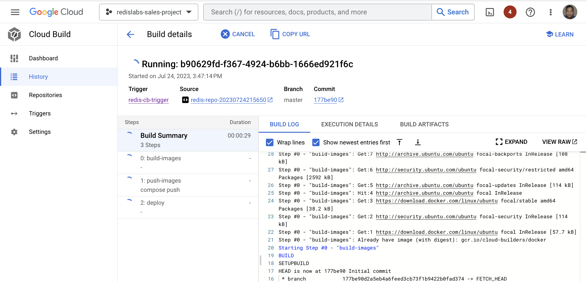
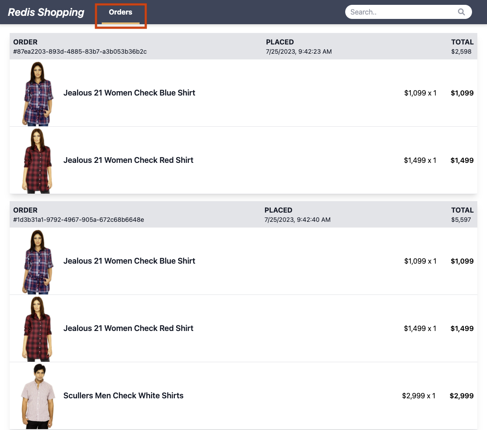

# Lab 6:  Re-deploy the sample app using the CloudSQL PostgreSQL backend along with Redis Data Integration

Delete the current application deployment:
```bash
kubectl delete -f k8s
```

Delete the existing Cloud Build trigger:
```bash
gcloud alpha builds triggers delete $REDIS_CLOUD_BUILD_TRIGGER --region=$CLUSTER_LOCATION
```
          
Deploy a new Trigger with IS_RDI_ENABLED = "true":
```bash
export PROJECT_ID=$(gcloud info --format='value(config.project)')
export CLUSTER_LOCATION=us-central1
export CLUSTER_NAME="redis-gke-cluster-$CLUSTER_LOCATION"
export REDIS_API_GATEWAY_IP="$(gcloud compute addresses describe redis-api-gateway-ip --region=us-central1 --format='value(address)')"
export REDIS_CLIENT_HOST_IP="$(gcloud compute addresses describe redis-client-host-ip --region=us-central1 --format='value(address)')"
export DATABASE_URL="postgresql://postgres:postgres@${POSTGRESQL_INSTANCE_IP}:5432/dbFashion?schema=public"
export REDIS_CLOUD_BUILD_TRIGGER="redis-cb-trigger"
export IS_RDI_ENABLED="true"

gcloud alpha builds triggers create cloud-source-repositories \
  --name=$REDIS_CLOUD_BUILD_TRIGGER \
  --repo=$REDIS_REPO \
  --branch-pattern=^master$ \
  --build-config=cloudbuild.yaml \
  --substitutions=_GKE_CLUSTER=$CLUSTER_NAME,_GKE_ZONE=$CLUSTER_LOCATION,_API_GATEWAY_IP=$REDIS_API_GATEWAY_IP,_CLIENT_IP=$REDIS_CLIENT_HOST_IP,_REDIS_URI=$REDIS_URI,_REDIS_INSIGHT_PORT=$REDIS_INSIGHT_PORT,_DATABASE_URI=$DATABASE_URL,_IS_RDI_ENABLED=$IS_RDI_ENABLED \
  --region=$CLUSTER_LOCATION
```
When the `IS_RDI_ENABLED` flag is set to "true", you can inspect [these lines of code](https://github.com/gmflau/google-dev-day-workshop/blob/main/server/src/services/orders/src/service-impl.ts#L163-L165) will bypass the `addOrderToRedis(order)` call and let RDI replicate the order information from CloudSQL to Redis.
                   
Run the trigger to deploy the sample app:
```bash
gcloud alpha builds triggers run $REDIS_CLOUD_BUILD_TRIGGER --branch=master --region=$CLUSTER_LOCATION
```
It will take about 9 or more minutes to complete the build and deployment of the microservices application. You can check the progress in Google Cloud Console's Cloud Build page:

                  
Once the application is deployed, You can now access the sample app and make a few purchases by pointing your browser at:
```
http://<$REDIS_CLIENT_HOST_IP>:4200
```
You can find the REDIS_CLIENT_HOST_IP by running this command `kubectl get all` and look for the line item starting with **service/client**:
```
For example, 

service/client          LoadBalancer   10.100.5.142    35.184.250.110   4200:30519/TCP   2m25s
```
      
When you try to access `Orders History` now, the order history information is replicated from CloudSQL (PostgreSQL) to Redis by RDI. 
   
     
You can view the data replication transactions from CloudSQL (PostgreSQL) as source to Redis as target using the command below:
```bash
kubectl exec -n default -it pod/redis-di-cli -- redis-di status
```
      
[<< Previous Lab <<](../lab5/README.md)     |      [>> Next Lab >>](../lab7/README.md)

