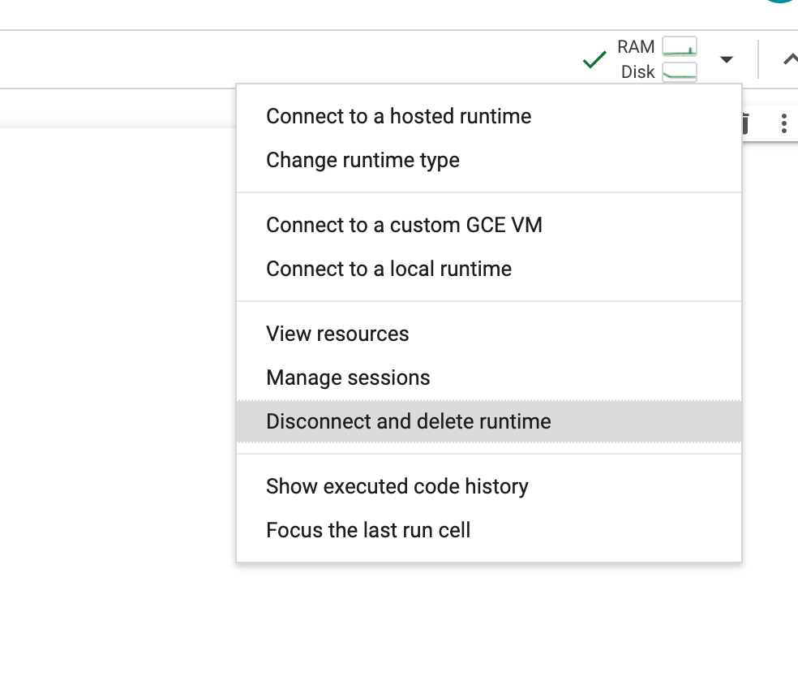
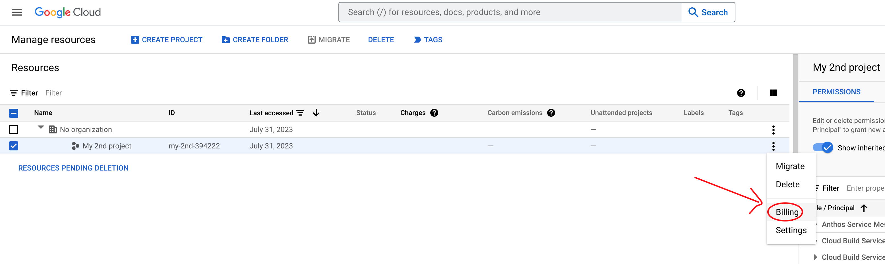
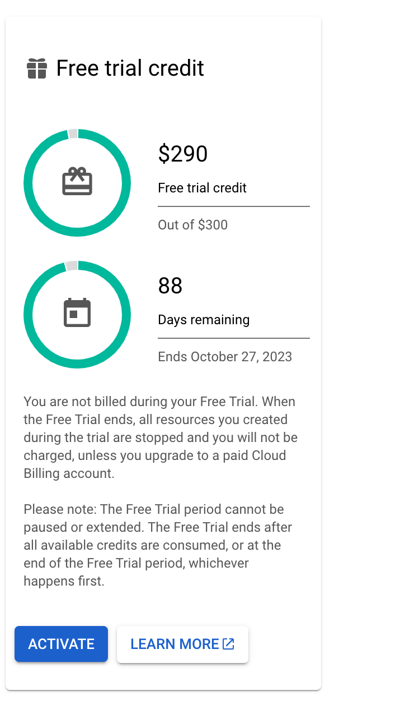
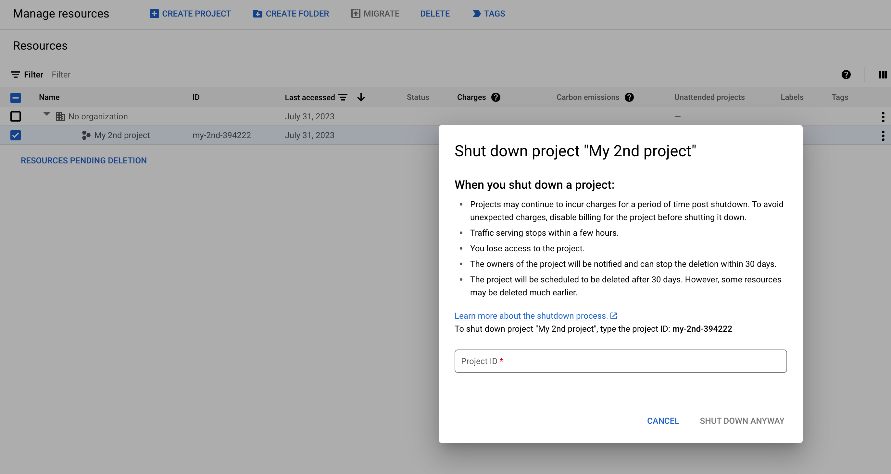
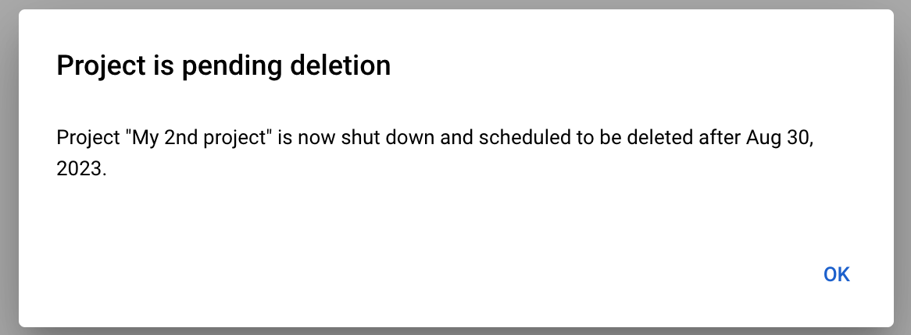

# Lab 9: Cleanup

In this lab, you are going to:
* Cleanup all resources so that you do not incur un-intended charges from Google Cloud.

You can delete the runtime of your Colab environment from Lab8, by simply clicking on `Disconnect and delete runtime` option.

In GCP, if yo delete the project, all the cloud resources you have provisioned, are all shutdown. So, the clean up is as simple as deleting a project. But before you do so, make sure your project Billing is not set.
Go to `Billing` on your project.

If you are using a vanilla GCP account with free credit, the billing is not started on it. You can confirm this by looking at the `Free trial credit` panel. The fact that `ACTIVATE` button is enabled, means your billing has not started.  Do NOT ACTIVATE it, if you have credits still remaining.  But you are good because Billing has not started yet.

Now you can go ahead and delete the Project, by selecting it and hitting `DELETE` button.

Project may be flagged for deletiong at a later date, but do not worry. All of your cloud resources are shutdown.

You are all good.

[<< Previous Lab (8) <<](../lab8/README.md)
