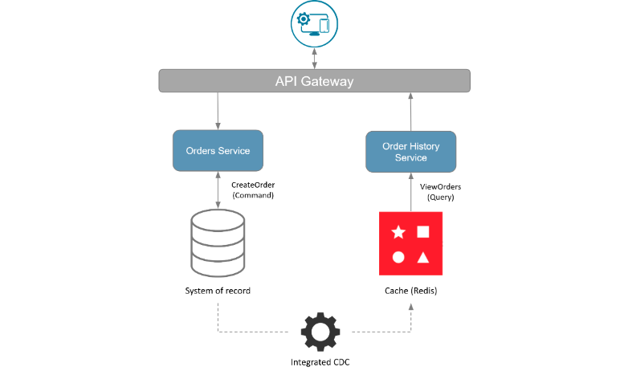
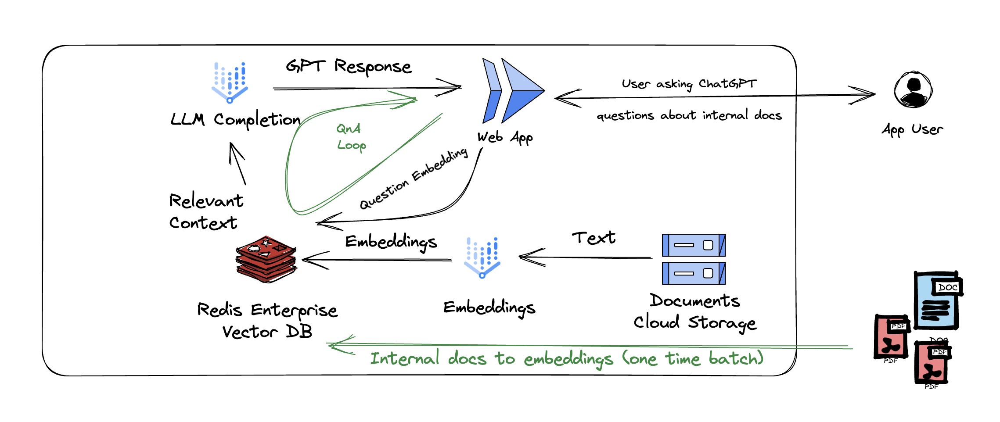

# Build Better, Faster Applications – Faster Workshop (google-dev-day-workshop)

The sample app used in this workshop is a cloud-first microservices demo application that allows a customer to populate a shopping cart with products. The site has a "Buy Now" button to facilitate ordering those products. It sets up and populatea product database (perhaps a SQL database). A backend API to handle the processes of creating an order, creating an invoice, processing payments, handling fulfillment, and updating the customer's order history.

Being deployed on Google Kubernetes Engine (GKE) cluster enabled with Anthos Service Mesh, it provides the app with a horizontally scalable infrastructure as the demand grows as well as observabilty of the underlying microservices to identify any bottlenecks or chances to voilate said SLO/SLA. Further to that, it will provide finer-grained security as to how each microservices can be assessed.

In this workshop, we leverage Google Cloud Build to build and push the container images of the microservices to Google Container Registry (gcr.io). Then the same Cloud Build trigger deploys the microservices on to a running GKE cluster. This provides a repeatable and prescribed build and deployment process for CI/CD purposes.
    
Inside the app itself, it uses a microservices approach with Common Query Responsibility Separation (CQRS) pattern which allows you to scale your reads and writes independently as well as aid in decoupling your microservices. With a CQRS model, a single service is responsible for handling an entire command from end to end. One service should not depend on another service in order to complete a command. It achieves that by writing to Redis Enterprise as pre-fetched cache and writing to the backend SQL database as source of truth at the same time. Then follow-on reads will be from Redis Enterprise with minimum latency.

    
This is not an elegant solution to implement CQRS. We will introduce Redis Data Integration (RDI) which addresses common enterprise caching patterns such as write-behind, write-through, CQRS, etc. in a developer-friendly fashion. By that I mean the implementation of these enterprise caching patterns are made easy to realize in your application stack with little to no coding necessary. In this workshop, we will use RDI pre-fetching capability to implement read-optimized on Redis Enterprise and write-optimized on the SQL database. It no longer requires writing the piece of data to Redis Enterprise while writing the same piece of data to the backend SQL database. RDI is responsible for replicating changes in the backend SQL database to Redis Enterprise database near real-time without impacting application performance. As a result, developers can develop faster applications faster than ever before.
    
Then we will make a slight turn to the most popular topic in the application development world, Generative Artificial Intelligence. Gen AI in short. It makes your applications better and richer by leveraging generative AI to creates business value by automating, speeding up, and scaling the process of creating new content. Teaming Gen AI of Vertex AI portofolio up with Redis Enterprise as Vector database, developers can build better and more intelligent apps to produce richer and more refined AI-powered engaging experience.
    
    
     
#### Workshop Agenda: [~4 hours duration]
<!-- BEGIN_AGENDA -->
| Section    | Time    |
|:-----------|:--------|
| Check-in | 30 minutes |
| Age of real time | 20 minutes |
| Modern Application Architecture | 30 minutes |
| Development and Deployment Labs - Part I | 45 minutes |
| Break | 15 minutes |
| Development and Deployment Labs - Part II | 45 minutes |
| Gen AI powered applications | 30 minutes |
| Event closing | 15 minutes |
<!-- END_AGENDA -->
       
     
#### Top three key takeaways
* How to build cloud native applications using the latest capabilities of Google Cloud and Redis Enterprise
* The latest and greatest features of real-time applications
* How the combination of Gen AI and Redis as a Vector database can help you build Gen AI powered applications

#### Requirements
These hands-on labs are very intense from technical experience standpoint. These hands-on labs are targeted for Application Developers, DevOps, Technical Leads and Architects. If you are not in any of the above mentioned roles, it would be a disservice for yourself to go any further beyond this point. But if you are one of those most curious souls who do not shy away from getting hands-dirty, we still welcome you to hop on the journey.

     
#### Lab Agenda:
Part 1: Development and Deployment Labs - Part I
* [Lab 0:](./lab0/) Open a Google Cloud Shell and Enable APIs
* [Lab 1:](./lab1/) Create a Cloud Source repo for the workshop sample app
* [Lab 2:](./lab2/) Create Google Cloud Infrastrcuture Components
* [Lab 3:](./lab3/) Create a Redis Enterprise Cloud subscription on Google Cloud
* Break [15 minutes]
    
Part 2: Development and Deployment Labs - Part II
* [Lab 4:](./lab4/) Create a Google Cloud Build Trigger and Deploy the Sample App
* [Lab 5:](./lab5/) Set up Redis Data Integration (RDI)
* [Lab 6:](./lab6/) Re-deploy the sample app using the CloudSQL PostgreSQL backend along with Redis Data Integration (RDI)
* [Lab 7:](./lab7/) Microservices Observability Walkthrough
    
Part 3: Gen AI powered applications - How Gen AI + Redis VSS can work together
* [Lab 8:](./lab8/VertexAI_LangChain_Redis.ipynb) Document Question Answering with Langchain, VertexAI and Redis
      

     
